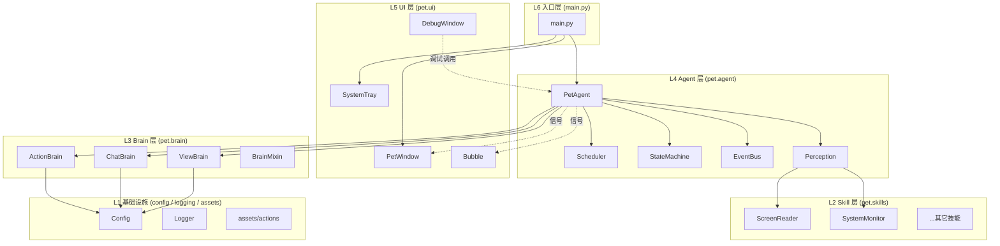
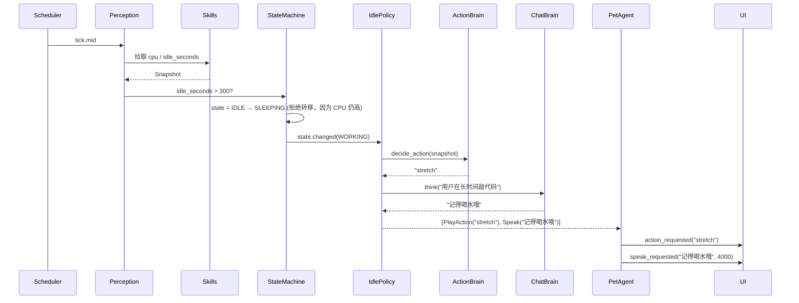

# DeskPet 架构设计文档

> **版本**：v1.0（最终迭代基准）
> **状态**：设计稿，作为后续所有迭代的对齐目标
> **关键原则**：分层清晰 / 可插拔 / 事件驱动 / 不在 Agent 层引入 LLM

---

## 0. 文档目的

本文档描述 DeskPet 项目从当前 MVP 演进到「成熟可扩展桌宠 AI 框架」时的最终目标架构。
当前代码（`pet/brain/`、`pet/skills/`、`pet/ui/`）已是该架构的雏形，本文档负责回答以下问题：

1. 现有模块该如何归位？
2. 新增的 **Agent 调度层** 应承担什么职责、不承担什么职责？
3. 未来要加新动作 / 新感知 / 新对话能力 / 新 UI 形态 时，应该改哪里、不应该改哪里？
4. 各层之间通过什么协议通信？

**本文档不要求一次性实现所有内容**，但任何后续迭代都不应偏离这里规定的分层与协议。

---

## 1. 设计理念

| 原则 | 含义 | 落地方式 |
|---|---|---|
| **单向依赖** | UI ← Agent ← Brain / Skills，禁止反向引用 | 用 Signal/事件总线代替反向调用 |
| **能力 vs 决策分离** | Skills 负责"我能做什么"，Brain 负责"我想做什么"，Agent 负责"现在该做什么" | 三者通过显式接口通信 |
| **可插拔** | 新增技能/动作/Brain 不修改核心调度代码 | Registry + 协议接口 |
| **离线可用** | 断网时仍能跑，不至于成砖 | 每个 Brain 都需提供 `local` fallback |
| **Agent 层不接 LLM** | 调度逻辑必须可预测、零 token 成本 | Agent 仅做规则编排和事件路由 |
| **配置驱动** | 行为节奏、Brain 后端、模型名 全部通过配置切换 | `config.py` + `.env` |

---

## 2. 总览：六层架构



### 层职责

| 层 | 职责 | 禁止 |
|---|---|---|
| L1 基础设施 | 配置、日志、静态资源 | 业务逻辑 |
| L2 Skills | 与外部世界交互（截屏、读 CPU、文件等） | 调用 Brain 或 UI |
| L3 Brain | 把"输入文本/图像"转成"输出文本/动作名" | 主动触发自己；操作 UI |
| L4 Agent | 编排：何时感知、何时思考、把结果发给谁 | 包含 LLM；操作 Qt 控件细节 |
| L5 UI | 渲染、动画、用户输入事件 | 直接调用 Brain 或 Skill |
| L6 入口 | 装配各层、注入依赖 | 业务逻辑 |

---

## 3. 模块详解

### 3.1 L2 Skills —— 能力提供方

```
pet/skills/
├── __init__.py            # 导出 + Skill 基类
├── base.py                # Skill 抽象基类（新增）
├── registry.py            # SkillRegistry（新增）
├── screen_reader.py       # 已存在
├── system_monitor.py      # 已存在
├── input_monitor.py       # 未来：键鼠空闲检测
├── window_inspector.py    # 未来：当前活动窗口名
└── notifier.py            # 未来：发系统通知
```

#### Skill 基类（最终接口）

```python
class Skill(ABC):
    name: str                       # 唯一标识，如 "screen_reader"
    enabled: bool = False

    def enable(self) -> None: ...
    def disable(self) -> None: ...
    def health_check(self) -> bool: ...   # 自检（如 mss 可用性）
```

#### SkillRegistry

- 单例，启动时由 `main.py` 注册所有 Skill
- Agent 通过 `registry.get("screen_reader")` 获取实例
- 支持运行时启停（用户在调试面板切换权限）

### 3.2 L3 Brain —— 思考者

```
pet/brain/
├── __init__.py
├── base.py                # BrainMixin + Brain 基类
├── action_brain.py        # 已存在
├── chat_brain.py          # 已存在
├── view_brain.py          # 已存在
└── memory.py              # 未来：长程记忆 / 向量库
```

#### Brain 接口约束

每个 Brain 都需满足：

1. **构造时根据 `config.<NAME>_BRAIN` 选择后端**：`local` / `llm` / `ollama`。
2. **必须有 local fallback**：断网或缺 key 时不抛异常，返回保底结果。
3. **不主动调用 Skill 或 UI**——只接收文本/图像，输出文本/动作名。
4. **状态隔离**：Brain 的对话上下文与 Agent 的调度状态彼此独立。

#### 三个 Brain 的输入输出契约

| Brain | 输入 | 输出 |
|---|---|---|
| `ActionBrain` | `context: str` | `action: str`（必须 ∈ 已注册动作集） |
| `ChatBrain` | `prompt: str` | `reply: str`（≤100 token） |
| `ViewBrain` | `image: PIL.Image, prompt: str` | `summary: str` |

#### 后续扩展

- `chat_brain` 升级为 **function-calling**：`think(prompt) -> ChatResult(text, action?, emotion?)`，但调用模型仍只一次，无额外成本。
- `memory.py` 提供 `Memory.recall(query) -> List[str]`，可被任何 Brain 注入到 prompt。

### 3.3 L4 Agent —— 编排核心（新增层，本文档重点）

```
pet/agent/
├── __init__.py
├── pet_agent.py           # 主入口：组装 + 启动/停止
├── scheduler.py           # 多频率 Tick 管理
├── state.py               # 状态机（PetState 枚举 + 转移规则）
├── perception.py          # 感知聚合：把 Skill 输出整理成 Snapshot
├── events.py              # 事件总线（基于 Qt Signal 的薄封装）
├── policies/              # 决策策略（可插拔）
│   ├── __init__.py
│   ├── base.py            # Policy 抽象基类
│   ├── idle_policy.py     # 空闲时该播什么动作
│   ├── reactive_policy.py # 高 CPU/用户卡顿时怎么反应
│   └── chat_policy.py     # 聊天触发条件
└── actions/               # 复合行为（如"打招呼"=动画+气泡+音效）
    ├── __init__.py
    ├── base.py            # CompositeAction 基类
    ├── greet.py
    └── nap.py
```

#### 3.3.1 PetAgent —— 唯一对外门面

```python
class PetAgent(QObject):
    # 对外信号（UI 订阅）
    action_requested  = Signal(str)        # action_name
    speak_requested   = Signal(str, int)   # text, duration_ms
    state_changed     = Signal(str)        # new_state

    def __init__(self, skills: SkillRegistry, brains: BrainRegistry): ...
    def start(self): ...
    def stop(self): ...

    # 暴露给 UI/调试面板的命令
    def trigger(self, intent: str, **kwargs): ...
    def force_state(self, state: PetState): ...
```

**职责清单**：

- ✅ 装配 Scheduler / StateMachine / Perception / EventBus
- ✅ 订阅 EventBus 事件，路由到对应 Policy
- ✅ 把 Brain 的输出通过 Signal 发给 UI
- ❌ **不直接操作 Qt 控件**（只发 Signal）
- ❌ **不调用 LLM API**（思考工作交给 Brain）

#### 3.3.2 Scheduler —— 多频率心跳

行为决策需要不同节奏，硬编码"30 秒决策一次"是不够的：

| Tick | 频率 | 用途 |
|---|---|---|
| `fast`  | 1 s   | 状态维护、UI 同步 |
| `mid`   | 30 s  | 行为决策（调用 ActionBrain） |
| `slow`  | 5 min | 屏幕分析（调用 ViewBrain，token 贵） |
| `event` | 即时  | 用户交互/外部事件触发 |

频率全部由 `config` 控制，运行时可调。

#### 3.3.3 StateMachine —— 显式状态枚举

```python
class PetState(Enum):
    IDLE        = "idle"
    WORKING     = "working"      # 用户活跃 / 高 CPU
    SLEEPING    = "sleeping"     # 长时间无输入
    TALKING     = "talking"      # 正在显示气泡
    INTERACTING = "interacting"  # 用户拖拽/点击中
```

**为什么要状态机**：避免出现"睡眠中却被要求播放 walk 动画"这种荒诞组合。每个状态显式声明允许的转移和合法动作集。

#### 3.3.4 Perception —— 感知快照

```python
@dataclass
class Snapshot:
    ts: datetime
    cpu: float
    mem: float
    idle_seconds: int
    active_window: str | None
    screen_summary: str | None   # ViewBrain 最近一次结果
```

`Perception` 把多源数据聚合成一个 Snapshot，作为 Brain 的统一输入，避免 Brain 自己去 import Skill。

#### 3.3.5 EventBus —— 解耦核心

基于 `QObject + Signal` 实现，所有跨模块通信走这里：

| 事件 | 发布者 | 订阅者 |
|---|---|---|
| `tick.mid` | Scheduler | Policy |
| `state.changed` | StateMachine | UI / Policy |
| `user.click_pet` | PetWindow | Agent |
| `user.message` | DebugWindow | ChatPolicy |
| `skill.screen.captured` | ScreenReader | Perception |
| `brain.action.decided` | ActionBrain | UI |
| `brain.chat.reply` | ChatBrain | Bubble |

**好处**：UI 不知道 Brain 存在，Brain 不知道 UI 存在；调试面板可以直接 emit/订阅事件来模拟任意场景。

#### 3.3.6 Policies —— 可插拔决策策略

每个 Policy 是一个对象：

```python
class Policy(ABC):
    triggers: list[str]   # 订阅哪些事件

    def handle(self, event: Event, ctx: AgentContext) -> list[Command]:
        ...
```

返回的 `Command` 是声明式指令（如 `PlayAction("walk")`、`Speak("你好")`），由 Agent 统一执行。这意味着**新增行为模式只要写一个 Policy 类并注册**，不用改 PetAgent。

#### 3.3.7 CompositeAction —— 复合行为

某些行为是组合的，例如「打招呼」= 播放 `greet_user` 动画 + 显示气泡 + 短暂 TALKING 状态。封装成 `CompositeAction` 后，Policy 只需返回 `Greet()`，避免每个 Policy 自己拼装。

### 3.4 L5 UI —— 渲染与输入

```
pet/ui/
├── __init__.py
├── base_window.py
├── pet_window.py          # 接收 Agent.action_requested 信号
├── pet_animations.py
├── bubble.py              # 接收 Agent.speak_requested 信号
├── debug_window.py        # 调用 agent.trigger(...) / 订阅事件总线
├── system_tray.py
└── theme.py               # 未来：皮肤/主题切换
```

**关键改造**：
- `PetWindow` / `Bubble` 不再 `new ChatBrain()`，改为通过 Signal 接收来自 Agent 的指令。
- `DebugWindow` 通过 `agent.trigger("greet")` 等高级命令操作，而不是直接调 Brain 实例。

### 3.5 L6 入口 —— 装配

```python
# main.py 最终形态
def main():
    app = QApplication(sys.argv)
    app.setQuitOnLastWindowClosed(False)

    # 1. 基础设施
    setup_logging()

    # 2. 注册 Skills
    skills = SkillRegistry()
    skills.register(ScreenReader())
    skills.register(SystemMonitor())

    # 3. 注册 Brains
    brains = BrainRegistry()
    brains.register("action", ActionBrain())
    brains.register("chat",   ChatBrain())
    brains.register("view",   ViewBrain())

    # 4. 创建 Agent（注入依赖，不耦合具体类型）
    agent = PetAgent(skills=skills, brains=brains)

    # 5. UI 层 + 信号绑定
    window = PetWindow()
    bubble = SpeechBubble(window)
    agent.action_requested.connect(window.play_action)
    agent.speak_requested.connect(bubble.show_text)
    window.show()

    # 6. 启动
    agent.start()
    SystemTrayManager(app, window, agent)
    sys.exit(app.exec())
```

---

## 4. 数据流：一次完整循环

以"用户敲代码 5 分钟没动 → 桌宠主动关心一句"为例：



整条链上：
- **没有任何反向依赖**
- **Agent 没调用 LLM**，所有 LLM 调用都被关在 Brain 里
- **新增"提醒喝水"策略**只需改 `IdlePolicy` 或加一个新 Policy

---

## 5. 配置约定

```ini
# .env (最终版)

# === Brain 后端 ===
ACTION_BRAIN=llm           # local | llm | ollama
CHAT_BRAIN=llm
VIEW_BRAIN=llm

# === 模型 / Key ===
CHAT_MODEL=deepseek-v4-pro
CHAT_MODEL_KEY=...
ACTION_MODEL=...
VIEW_MODEL=...
OLLAMA_BASE_URL=http://localhost:11434/v1

# === Agent 调度节奏 ===
AGENT_TICK_FAST_MS=1000
AGENT_TICK_MID_MS=30000
AGENT_TICK_SLOW_MS=300000
AGENT_IDLE_THRESHOLD_S=300

# === Skills 默认权限 ===
SKILL_SCREEN_READER_ENABLED=false   # 涉及隐私，默认关
SKILL_SYSTEM_MONITOR_ENABLED=true

# === UI ===
PET_WIDTH=128
PET_HEIGHT=128
PET_FPS=8
```

`config.py` 用 `BaseSettings`（pydantic）读取并提供类型校验。

---

## 6. 扩展点清单

| 想做什么 | 改哪里 | **不改**哪里 |
|---|---|---|
| 加一个新动作（如 dance） | `assets/actions/dance/` + `ActionBrain._actions` | UI / Agent |
| 加一个新感知（如读剪贴板） | 新建 `pet/skills/clipboard.py` 实现 `Skill` | Agent / Brain |
| 加一种行为模式（如番茄钟提醒） | 新建 `pet/agent/policies/pomodoro.py` | UI / Brain / Skills |
| 接入新模型供应商 | 在三个 Brain 的 `__init__` 加 `elif brain == "anthropic"` 分支 | Agent |
| 加一个新 UI 形态（如迷你模式） | 新建 `pet/ui/mini_window.py`，订阅同一组 Signal | Agent / Brain |
| 加长程记忆 | 新建 `pet/brain/memory.py`，让 Brain 在 prompt 前注入 | Agent |
| 用户自定义对话 | DebugWindow `emit user.message` → ChatPolicy 处理 | Agent 核心 |
| 加皮肤/主题切换 | `pet/ui/theme.py` + `assets/themes/<name>/` | 其它一切 |

---

## 7. 目录最终形态

```
DeskPet/
├── main.py
├── config.py
├── ARCHITECTURE.md           ← 本文档
├── .env / .env.example
├── requirements.txt
├── assets/
│   ├── actions/<name>/*.png
│   └── themes/<name>/        ← 未来
├── logs/
└── pet/
    ├── __init__.py
    ├── agent/                ← 新增
    │   ├── __init__.py
    │   ├── pet_agent.py
    │   ├── scheduler.py
    │   ├── state.py
    │   ├── perception.py
    │   ├── events.py
    │   ├── policies/
    │   │   ├── __init__.py
    │   │   ├── base.py
    │   │   ├── idle_policy.py
    │   │   ├── reactive_policy.py
    │   │   └── chat_policy.py
    │   └── actions/
    │       ├── __init__.py
    │       ├── base.py
    │       ├── greet.py
    │       └── nap.py
    ├── brain/
    │   ├── __init__.py
    │   ├── base.py
    │   ├── registry.py        ← 新增
    │   ├── action_brain.py
    │   ├── chat_brain.py
    │   ├── view_brain.py
    │   └── memory.py          ← 未来
    ├── skills/
    │   ├── __init__.py
    │   ├── base.py            ← 新增
    │   ├── registry.py        ← 新增
    │   ├── screen_reader.py
    │   ├── system_monitor.py
    │   ├── input_monitor.py   ← 未来
    │   └── window_inspector.py← 未来
    └── ui/
        ├── __init__.py
        ├── base_window.py
        ├── pet_window.py
        ├── pet_animations.py
        ├── bubble.py
        ├── debug_window.py
        ├── system_tray.py
        └── theme.py           ← 未来
```

---

## 8. 迭代路线图

| 迭代 | 目标 | 范围 |
|---|---|---|
| **M1：Agent 落地（MVP）** | 让桌宠"自己活起来" | `pet_agent.py` + `scheduler.py` + `state.py`，单一 IdlePolicy；改造 main.py |
| **M2：Skill / Brain 注册化** | 解耦构造，DebugWindow 不再自己 new Brain | `skills/registry.py` + `brain/registry.py` |
| **M3：事件总线 + Policy 拆分** | 上面手写的 if/else 拆成多个 Policy | `events.py` + `policies/*` |
| **M4：感知聚合 + 屏幕分析定时** | 引入 ViewBrain 的自主调用节奏 | `perception.py` + `slow tick` |
| **M5：CompositeAction + Chat 触发** | 桌宠会主动说话 | `actions/greet.py` + `chat_policy.py` |
| **M6：长程记忆 / 主题切换** | 体验升级 | `brain/memory.py` + `ui/theme.py` |
| **M7（可选）：LLM Planner** | 真正的 AI Agent | 在 Agent 层引入可选的 LLM planner，与规则模式共存 |

每个迭代都不破坏前一个迭代的接口，是**纯增量演进**。

---

## 9. 反模式（明确禁止）

1. ❌ Brain 内部 `import pet.ui.*`：UI 反向依赖。
2. ❌ Skill 内部调用另一个 Skill 或 Brain：能力层应保持原子。
3. ❌ Agent 直接调用 `self.pet_window.pet_label.setText(...)`：必须走 Signal。
4. ❌ 在 PetWindow 里写 `if cpu > 80: ...` 业务判断：业务在 Policy。
5. ❌ Brain 的 prompt 写死在代码里：必须从 `config.*_PROMPT_*` 读取。
6. ❌ 同一份 LLM Key 被两个 Brain 共享构造（除非显式同源）。
7. ❌ Agent 引入任何 OpenAI client：本架构基准明确禁止。

---

## 10. 验收标准（最终态）

实现到 M5 后，下面几条应同时成立：

- [ ] 删除所有 LLM Key，桌宠仍能跑（local 模式 + 默认 IdlePolicy）。
- [ ] 新增一个动作目录 `assets/actions/dance/` 后，重启即生效，无需改代码。
- [ ] 新增一个 Skill `clipboard_reader.py` 并注册后，可被 Policy 直接消费。
- [ ] DebugWindow 中的所有按钮都通过 `agent.trigger(...)` 调用，不持有 Brain 实例。
- [ ] 屏幕分析的频率/开关完全由 `.env` 控制，可随时关闭省 token。
- [ ] 单元测试可在不启动 Qt 事件循环的情况下覆盖 Policy 逻辑。

---

## 附录 A：与当前代码的差距

| 当前 | 与目标差距 | 优先级 |
|---|---|---|
| `main.py` 无 Agent | 整个 L4 缺失 | P0 |
| `DebugWindow` 直接 `new ChatBrain()` 等 | 应通过 `agent.brain` 获取 | P1 |
| `Skills` 无统一基类/注册表 | 重复的 enable/disable 模式 | P2 |
| `Brain` 无统一基类 | 三个 Brain 构造逻辑高度雷同 | P2 |
| 没有 EventBus | 模块间用方法调用耦合 | P1 |
| 没有 StateMachine | 行为冲突无防护 | P1 |

P0 即 M1 的内容，建议先做。

---

**END.** 任何对该架构的偏离应通过更新本文档（提升版本号）后再实施。
